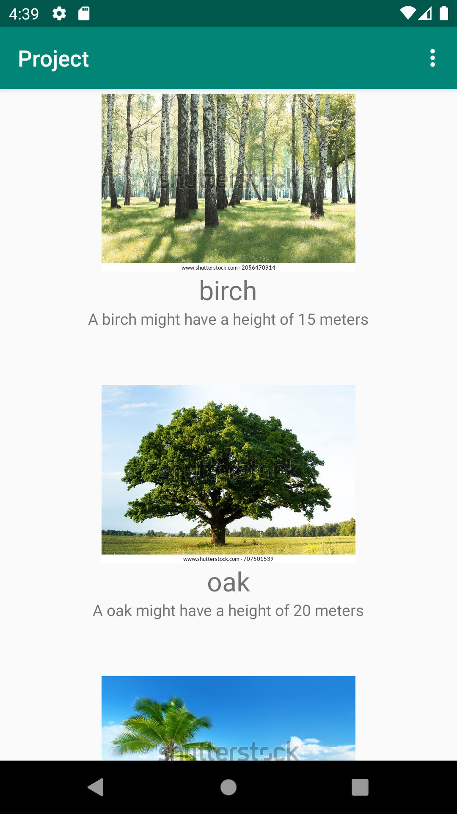
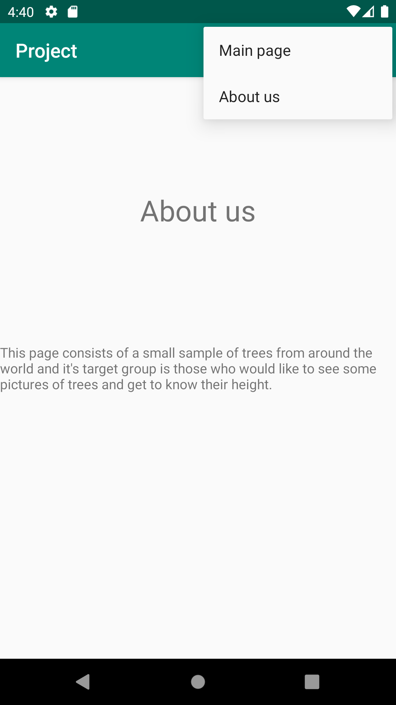

# Rapport

Detta projekt gick ut på att skapa json-data som skulle hämtas från en api och populera en recyclerview med denna data. Projektet använder sig
utav träd, med ID,Login , namn på trädet, höjden på trädet som "size" och en bildlänk som lagras i auxdata. Appen använder sig sedan av en
RecyclerviewAdapter för att populera recyclerviewn. För att få bilder att användas konverterade en ImageDownloader (AsyncTask) URLen till bitmap-format.
Den användes i adaptern i följande metod:


```

 @Override
    public void onBindViewHolder(@NonNull RecyclerviewAdapter.ViewHolder holder, int position) {
        holder.name.setText(listOfTrees.get(position).getName());
        holder.description.setText(String.format("A %s might have a height of %s meters", listOfTrees.get(position).getName(), listOfTrees.get(position).getSize()));
        ImageView imageView = holder.getImage();

        new ImageDownloader(imageView).execute(listOfTrees.get(position).getAuxdata());
    }


```

Sista raden använder sig utav tasken och skickar in ett specifikt träds position för att hämta auxdata och sedan körs metoden och bilden omvandlas.


Klassen som representerar ett träd ser ut på följande sätt med tillhörande getters:


```

       private int id;
       private String name;
       private int size;
       private String auxdata;

       public Tree(int id, String name, int height, String auxdata) {
           this.id = id;
           this.name = name;
           this.size = height;
           this.auxdata = auxdata;
       }

```

Följande kod visar knappen upp till höger i menyn, de 3 prickarna, vilket är navigationen mellan mainactivity och about us activity:


```

 @Override
    public boolean onCreateOptionsMenu(Menu menu) {
        getMenuInflater().inflate(R.menu.menu_item, menu);
        return true;
    }

    @Override
    public boolean onOptionsItemSelected(MenuItem item) {
        int id = item.getItemId();

        if (id == R.id.main_page) {
            return true;
        }

        if (id == R.id.about_us) {
            Intent intent = new Intent(this, AboutUsActivity.class);
            intent.addFlags(Intent.FLAG_ACTIVITY_CLEAR_TOP);
            startActivity(intent);
            return true;
        }

        return super.onOptionsItemSelected(item);
    }


```

Sedan beroende på vilken knapp man klickar på skapas ett intent och en ny activity. Ovan exempel är från mainactivity och har intent ifall man klickar på about us.
Detta är tvärtom i about us. Detta för att inte skapa onödig process eftersom man redan är inne på den aktiviteten.





